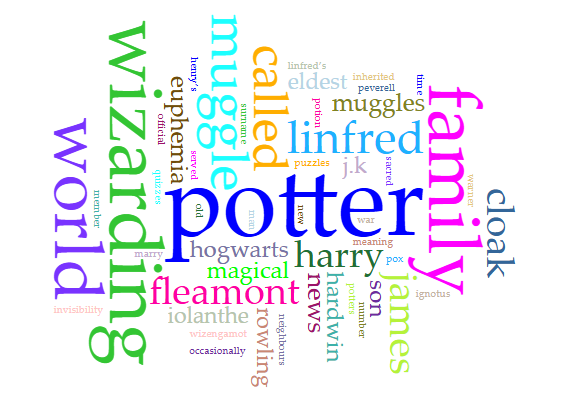



# Distant Reading Assignment 

I used Voyant to search this website! [Harry Potter Website!](https://www.harrypotter.com/writing-by-jk-rowling/the-potter-family)

<b>Check out my image:</b>

<b>What we can discern from these results:</b>

<ul>

  <li>Frequent words: The largest words (“potter,” “family,” “wizarding,” “world,” “muggle,” “linfred,” “fleamont,” “james,” “harry”) show the most frequent terms in the text.</li>
  <li>Main themes: Text is about the Potter family lineage, their place in the wizarding world, and key individuals. Words like cloak, wizengamot, invisibility, news, and magical highlight important lore elements.</li>
  <li>Names & relationships: Several generations of Potters are referenced (Linfred, Fleamont, James, Harry). This shows that the passage discusses ancestry and family history.</li>

</ul>

<b>What we can’t know from these results:</b>

<ul>

  <li>Context or meaning: The word cloud doesn’t show how these words are used in sentences. For example, “cloak” might appear once but in a very significant context (the Invisibility Cloak).</li>
  <li>Word order or narrative: We don’t know how the family history unfolds, just that the words were present.</li>
  <li>Sentiment or tone: The visualization doesn’t reveal whether the text is positive, negative, historical, or personal.</li>
  <li>Accuracy of importance: Large words aren’t necessarily the most important concepts, just the most frequent.</li>
  
</ul>

<b>Are these results accurate?</b>

<ul>

<li>Yes, they seem accurate from the source I shared.</li>
<li>The word cloud matches the essay’s content: it discusses Linfred of Stinchcombe (an ancestor), Fleamont (Harry’s grandfather), James (Harry's father) & Harry; and their connections to the wizarding and Muggle worlds.</li>
<li>However, accuracy is limited: frequency-based visualizations don’t capture nuance, context, or narrative importance. For example, “cloak” may be small but is actually central to the Potters’ legacy.</li>
  
</ul>

---
I also tried Copilot! with ChatGPT-5 and here's a bit of our conversation:

 <b>Me:</b> Can you analyze this website's text? https://www.harrypotter.com/writing-by-jk-rowling/the-potter-family

 <b>Copilot:</b> I’ve reviewed the text from the official Harry Potter site about The Potter Family, and here’s an analysis of its key elements:

<h1>Main Themes</h1>

<ol>
  
  <li>Historical Background</li>
    
  <ul>
    
  <li>The Potter family is described as an old wizarding family, but not historically prominent until Harry’s birth.</li>

  <li>They were excluded from the “Sacred Twenty-Eight” list of pure-blood families because of suspected Muggle ancestry.</li>

  </ul>
  
  <li>Origins and Lineage</li>

  <ul>
    
  <li>The family descends from Linfred of Stinchcombe, a 12th-century wizard known for his eccentricity and medicinal skills.</li>

  <li>Linfred’s experiments laid the foundation for the family’s wealth, creating potions like Skele-gro and Pepperup Potion.</li>

  </ul>

  <li>Connection to the Peverells</li>

  <ul>
    
  <li>Linfred’s son, Hardwin, married Iolanthe Peverell, granddaughter of Ignotus Peverell (one of the Deathly Hallows’ original owners).</li>

  <li>The Invisibility Cloak became a family heirloom, passed down secretly through generations.</li>

  </ul>

  <li>Notable Potters</li>

  <ul>
    
  <li>Ralston Potter: Wizengamot member (1612–1652), supported the Statute of Secrecy.</li>

  <li>Henry Potter: Wizengamot member (1913–1921), defended Muggles during WWI, causing controversy.</li>

  <li>Fleamont Potter: Invented Sleekeazy’s Hair Potion, greatly increasing family wealth.</li>

  </ul>

  <li>Modern Era</li>

  <ul>
    
  <li>Fleamont and Euphemia were James Potter’s parents. They died of dragon pox before Harry was born.</li>

  <li>James inherited the Invisibility Cloak, which later passed to Harry.</li>

  </ul>

</ol>

<h1>Tone and Style</h1>
  <ul>
  
  <li>Informative and narrative: Reads like a historical account with personal anecdotes.</li>
  <li>Canonical depth: Adds lore beyond the main books, connecting to themes like blood purity, secrecy, and family legacy.</li>

  </ul>

<h1>Underlying Messages</h1>
  <ul>
    
  <li>Blood status critique: The family’s exclusion from the Sacred Twenty-Eight highlights prejudice in wizarding society.</li>
  <li>Legacy and humility: Despite wealth and influence, the Potters remained relatively low-profile until Harry.</li>
    
  </ul>

---
The results of this analysis reveal that the text offers a detailed historical account of the Potter family, highlighting themes of legacy, social status, and humility. Using distant reading tools, I was able to extract key themes, tone, and structural elements without closely reading every word. This process taught me that these tools are excellent for summarizing large texts, identifying recurring ideas, and organizing information into clear categories. However, they cannot fully capture the emotional nuance, stylistic subtleties, or the immersive experience of reading the text in its original form. In short, distant reading tools are powerful for efficiency and pattern recognition, but they lack the depth and interpretive richness that close reading provides.
