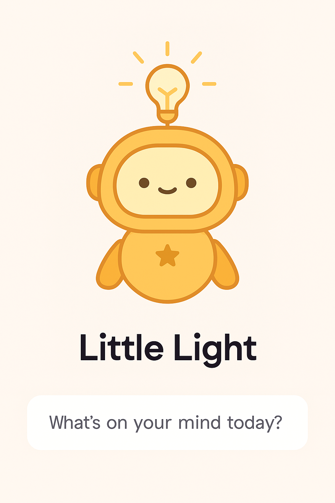

---
layout: default
title: Research Project
---  

# My Final Research Project  

    
    
    
    

# Abstract

<strong> Lighting the Way: Embedding Positive Psychology in AI Chatbot Design </strong>

Can a chatbot do more than answer questions? Can it uplift, motivate, and emotionally support its users? This project explores how artificial intelligence can be designed to foster mental wellness through emotionally intelligent communication.

In an increasingly digital world, people often turn to chatbots for support, guidance, or even companionship. Yet many bots lack the emotional nuance needed to truly connect with users. This project investigates how principles of positive psychology, including gratitude, optimism, and resilience, can be embedded into chatbot interactions to promote motivation and well-being. The goal is to celebrate the human need for emotional support and explore how technology can meet that need in thoughtful, affirming ways.

To explore this, I created Little Light, a motivational chatbot using the Botpress platform. Little Light was designed to offer encouragement, reflective prompts, and resilience-building messages. Through structured flows and personalized responses, the bot demonstrates how digital tools can embody emotional intelligence and support users in everyday moments. The project draws on research from psychology, human-computer interaction, and AI ethics to shape its design and evaluate its impact.

Studies show that chatbots can positively influence mood and reduce feelings of loneliness when designed with empathy and intention (Lopes et al.). A systematic review of psychological studies on human–chatbot communication highlights the importance of tone, responsiveness, and emotional framing in user experience (Rafikova and Voronin). Other research emphasizes the potential of positive psychological interventions (PPIs) in AI systems to increase happiness and resilience (Liu et al.). However, concerns remain about over-reliance on bots for emotional support and the need for ethical design (Fang et al.). By integrating these insights, Little Light aims to strike a balance between technological possibility and human-centered care.

Ultimately, this project calls attention to the emotional dimension of digital interaction and the potential for AI to support mental wellness. It encourages designers to think critically about how bots communicate, not just what they say, but how they make users feel. As AI becomes more embedded in daily life, projects like Little Light remind us that kindness, empathy, and optimism are not just human traits; they can be designed.

# Works Cited

  Fang, Cathy Mengying, et al. “How AI and Human Behaviors Shape Psychosocial Effects of Chatbot Use: A Longitudinal Controlled Study.” <em>MIT Media Lab</em>, 21 Mar. 2025, <a href="https://www.media.mit.edu/publications/how-ai-and-human-behaviors-shape-psychosocial-effects-of-chatbot-use-a-longitudinal-controlled-study/">https://www.media.mit.edu/publications/how-ai-and-human-behaviors-shape-psychosocial-effects-of-chatbot-use-a-longitudinal-controlled-study/</a>.

  Liu, Ivan, et al. “Assessing the Effectiveness of Using Chatbots for Positive Psychological Intervention: A Randomized Control Study.” <em>Chinese CHI 2022</em>, ACM, Oct. 2022, <a href="https://doi.org/10.1145/3565698.3565789">https://doi.org/10.1145/3565698.3565789</a>.

  Lopes, R. M., et al. “Chatbots for Well-Being: Exploring the Impact of Artificial Intelligence on Mood Enhancement and Mental Health.” <em>European Psychiatry</em>, Cambridge University Press, 27 Aug. 2024, <a href="https://www.cambridge.org/core/journals/european-psychiatry/article/chatbots-for-wellbeing-exploring-the-impact-of-artificial-intelligence-on-mood-enhancement-and-mental-health/13E4C926F650723E0705428AAAD030C6">https://www.cambridge.org/core/journals/european-psychiatry/article/chatbots-for-wellbeing-exploring-the-impact-of-artificial-intelligence-on-mood-enhancement-and-mental-health/13E4C926F650723E0705428AAAD030C6</a>.

  Rafikova, Antonina, and Anatoly Voronin. “Human–Chatbot Communication: A Systematic Review of Psychological Studies.” <em>AI & Society</em>, Springer, 6 Mar. 2025, <a href="https://link.springer.com/article/10.1007/s00146-025-02277-y">https://link.springer.com/article/10.1007/s00146-025-02277-y</a>.

  Fan, Jing. <em>AI Psychotherapists and Positive Psychology: A Systematic Literature Review</em>. Master’s thesis, LUT University, 2024, <a href="https://lutpub.lut.fi/bitstream/handle/10024/168817/mastersthesis_Jing_Fan.pdf">https://lutpub.lut.fi/bitstream/handle/10024/168817/mastersthesis_Jing_Fan.pdf</a>.

